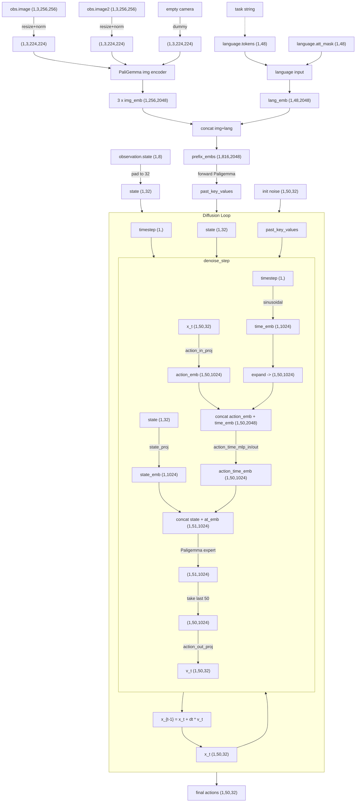

# 前言

![[file-20251016151950998.png]]

https://github.com/huggingface/lerobot 是HuggingFace提供的一个机器人代码库，包含了一些模拟环境和一些模型的代码。原始的 [[Pi-0|π0]]是Jax实现，最近推出了Pytorch版，而Lerobot把Pi-0的代码重构成了自己的版本，最近也支持了 [[Pi-0.5|π0.5]]的代码。

具体而言，Lerobot对 $\pi_0$ 的实现基本遵循了原封不动的代码，并用框架中的Policy包装起来。环境安装也十分简单，直接照着安装就可以。

# 代码分析

具体的代码在 https://github.com/huggingface/lerobot/tree/main/src/lerobot/policies/pi0 。其中[modeling_pi0.py](https://github.com/huggingface/lerobot/blob/main/src/lerobot/policies/pi0/modeling_pi0.py)是建模的核心代码。

代码中包含几个核心类，`PaliGemmaWithExpertModel`、`PI0Pytorch`和`PI0Policy`。其中`PaliGemmaWithExpertModel`是核心模型，包含了VLM和动作专家。`PI0Pytorch`是计算部分，实现了流匹配和动作生成部分。`PI0Policy`则是适应Lerobot框架的封装。

回顾一下 $\pi_0$ 的框架：

![[file-20251016153056692.png]]

概览图（可点击↔︎放大，往下拖）：



## PaliGemmaWithExpertModel

### 初始化

定义了一系列的Config，初始化核心部分

```python title="src/lerobot/policies/pi0/modeling_pi0.py#PaliGemmaWithExpertModel"
self.paligemma = PaliGemmaForConditionalGeneration(config=vlm_config_hf)
self.gemma_expert = GemmaForCausalLM(config=action_expert_config_hf)
self.gemma_expert.model.embed_tokens = None
```

其中动作专家是用的300M的Gemma模型。

### 嵌入

```python title="src/lerobot/policies/pi0/modeling_pi0.py#PaliGemmaWithExpertModel"
def embed_image(self, image: torch.Tensor):
    return self.paligemma.model.get_image_features(image)

def embed_language_tokens(self, tokens: torch.Tensor):
    return self.paligemma.language_model.embed_tokens(tokens)
```

分别调用PaliGemma的图像和语言模型得到图片和语言的嵌入。

### Forward

```python title="src/lerobot/policies/pi0/modeling_pi0.py#PaliGemmaWithExpertModel"
def forward(
    self,
    attention_mask: torch.Tensor | None = None,
    position_ids: torch.LongTensor | None = None,
    past_key_values: list[torch.FloatTensor] | None = None,
    inputs_embeds: list[torch.FloatTensor] | None = None,
    use_cache: bool | None = None,
    adarms_cond: list[torch.Tensor] | None = None,
):
    if adarms_cond is None:
        adarms_cond = [None, None]
    if inputs_embeds[1] is None:
        prefix_output = self.paligemma.language_model.forward(
            inputs_embeds=inputs_embeds[0],
            attention_mask=attention_mask,
            position_ids=position_ids,
            past_key_values=past_key_values,
            use_cache=use_cache,
            adarms_cond=adarms_cond[0] if adarms_cond is not None else None,
        )
        prefix_past_key_values = prefix_output.past_key_values
        prefix_output = prefix_output.last_hidden_state
        suffix_output = None
    elif inputs_embeds[0] is None:
        suffix_output = self.gemma_expert.model.forward(
            inputs_embeds=inputs_embeds[1],
            attention_mask=attention_mask,
            position_ids=position_ids,
            past_key_values=past_key_values,
            use_cache=use_cache,
            adarms_cond=adarms_cond[1] if adarms_cond is not None else None,
        )
        suffix_output = suffix_output.last_hidden_state
        prefix_output = None
        prefix_past_key_values = None
    else:
        models = [self.paligemma.language_model, self.gemma_expert.model]
        num_layers = self.paligemma.config.text_config.num_hidden_layers

        # Check if gradient checkpointing is enabled for any of the models
        use_gradient_checkpointing = (
            hasattr(self.gemma_expert.model, "gradient_checkpointing")
            and self.gemma_expert.model.gradient_checkpointing
            and self.training
        ) or (hasattr(self, "gradient_checkpointing") and self.gradient_checkpointing and self.training)

        # Process all layers with gradient checkpointing if enabled
        for layer_idx in range(num_layers):
            if use_gradient_checkpointing:
                inputs_embeds = torch.utils.checkpoint.checkpoint(
                    compute_layer_complete,
                    layer_idx,
                    inputs_embeds,
                    attention_mask,
                    position_ids,
                    adarms_cond,
                    use_reentrant=False,
                    preserve_rng_state=False,
                    paligemma=self.paligemma,
                    gemma_expert=self.gemma_expert,
                )
            else:
                inputs_embeds = compute_layer_complete(
                    layer_idx,
                    inputs_embeds,
                    attention_mask,
                    position_ids,
                    adarms_cond,
                    paligemma=self.paligemma,
                    gemma_expert=self.gemma_expert,
                )

        # final norm
        def compute_final_norms(inputs_embeds, adarms_cond):
            outputs_embeds = []
            for i, hidden_states in enumerate(inputs_embeds):
                out_emb, _ = models[i].norm(hidden_states, cond=adarms_cond[i])
                outputs_embeds.append(out_emb)
            return outputs_embeds

        # Apply gradient checkpointing to final norm if enabled
        if use_gradient_checkpointing:
            outputs_embeds = torch.utils.checkpoint.checkpoint(
                compute_final_norms,
                inputs_embeds,
                adarms_cond,
                use_reentrant=False,
                preserve_rng_state=False,
            )
        else:
            outputs_embeds = compute_final_norms(inputs_embeds, adarms_cond)

        prefix_output = outputs_embeds[0]
        suffix_output = outputs_embeds[1]
        prefix_past_key_values = None

    return [prefix_output, suffix_output], prefix_past_key_values
```

`imput_embeds`分为prefix和suffix，prefix包括图片和语言，suffix包括本体状态、时间步和带噪动作。其中的核心计算函数在定义的`compute_layers_complete`中：

```python title="src/lerobot/policies/pi0/modeling_pi0.py"
def compute_layer_complete(
    layer_idx, inputs_embeds, attention_mask, position_ids, adarms_cond, paligemma, gemma_expert
):
    models = [paligemma.language_model, gemma_expert.model]
    query_states = []
    key_states = []
    value_states = []
    gates = []
    for i, hidden_states in enumerate(inputs_embeds):
        layer = models[i].layers[layer_idx]
        hidden_states, gate = layer.input_layernorm(hidden_states, cond=adarms_cond[i])  # noqa: PLW2901
        gates.append(gate)
        input_shape = hidden_states.shape[:-1]
        hidden_shape = (*input_shape, -1, layer.self_attn.head_dim)
        query_state = layer.self_attn.q_proj(hidden_states).view(hidden_shape).transpose(1, 2)
        key_state = layer.self_attn.k_proj(hidden_states).view(hidden_shape).transpose(1, 2)
        value_state = layer.self_attn.v_proj(hidden_states).view(hidden_shape).transpose(1, 2)
        query_states.append(query_state)
        key_states.append(key_state)
        value_states.append(value_state)
    # Concatenate and process attention
    query_states = torch.cat(query_states, dim=2)
    key_states = torch.cat(key_states, dim=2)
    value_states = torch.cat(value_states, dim=2)
    dummy_tensor = torch.zeros(
        query_states.shape[0],
        query_states.shape[2],
        query_states.shape[-1],
        device=query_states.device,
        dtype=query_states.dtype,
    )
    cos, sin = paligemma.model.language_model.rotary_emb(dummy_tensor, position_ids)
    query_states, key_states = modeling_gemma.apply_rotary_pos_emb(
        query_states, key_states, cos, sin, unsqueeze_dim=1
    )
    batch_size = query_states.shape[0]
    scaling = paligemma.language_model.layers[layer_idx].self_attn.scaling
    # Attention computation
    att_output, _ = modeling_gemma.eager_attention_forward(
        paligemma.language_model.layers[layer_idx].self_attn,
        query_states,
        key_states,
        value_states,
        attention_mask,
        scaling,
    )
    # Get head_dim from the current layer, not from the model
    head_dim = paligemma.language_model.layers[layer_idx].self_attn.head_dim
    att_output = att_output.reshape(batch_size, -1, 1 * 8 * head_dim)
    # Process layer outputs
    outputs_embeds = []
    start_pos = 0
    for i, hidden_states in enumerate(inputs_embeds):
        layer = models[i].layers[layer_idx]
        end_pos = start_pos + hidden_states.shape[1]
        if att_output.dtype != layer.self_attn.o_proj.weight.dtype:
            att_output = att_output.to(layer.self_attn.o_proj.weight.dtype)
        out_emb = layer.self_attn.o_proj(att_output[:, start_pos:end_pos])
        # first residual
        out_emb = modeling_gemma._gated_residual(hidden_states, out_emb, gates[i])  # noqa: SLF001
        after_first_residual = out_emb.clone()
        out_emb, gate = layer.post_attention_layernorm(out_emb, cond=adarms_cond[i])
        # Convert to bfloat16 if the next layer (mlp) uses bfloat16
        if layer.mlp.up_proj.weight.dtype == torch.bfloat16:
            out_emb = out_emb.to(dtype=torch.bfloat16)
        out_emb = layer.mlp(out_emb)
        # second residual
        out_emb = modeling_gemma._gated_residual(after_first_residual, out_emb, gate)  # noqa: SLF001
        outputs_embeds.append(out_emb)
        start_pos = end_pos
    return outputs_embeds
```

前面的forward中将两个模型分开了`models = [self.paligemma.language_model, self.gemma_expert.model]`，这里的qkv也是分别利用两个模型进行计算的，将`inputs_embeds`分成了两个部分，分别传入两个模型的q、k、v的_proj得到qkv。

将得到的qkv利用torch.cat链接，统一计算注意力，后面再计算start_pos和end_pos切回。

## PI0Pytorch

### 初始化

```python title="src/lerobot/policies/pi0/modeling_pi0.py#PI0Pytorch"
paligemma_config = get_gemma_config(config.paligemma_variant)
action_expert_config = get_gemma_config(config.action_expert_variant)

self.paligemma_with_expert = PaliGemmaWithExpertModel(
    paligemma_config,
    action_expert_config,
    use_adarms=[False, False],
    precision=config.dtype,
)

self.action_in_proj = nn.Linear(config.max_action_dim, action_expert_config.width)
self.action_out_proj = nn.Linear(action_expert_config.width, config.max_action_dim)

self.state_proj = nn.Linear(config.max_state_dim, action_expert_config.width)
self.action_time_mlp_in = nn.Linear(2 * action_expert_config.width, action_expert_config.width)
self.action_time_mlp_out = nn.Linear(action_expert_config.width, action_expert_config.width)
```

除了定义了上面的带动作专家的PaliGemma外，还定义了动作映射、状态、动作时间的MLP。

### Prefix嵌入

```python title="src/lerobot/policies/pi0/modeling_pi0.py#PI0Pytorch"
def embed_prefix(
    self, images, img_masks, lang_tokens, lang_masks
) -> tuple[torch.Tensor, torch.Tensor, torch.Tensor]:
    """Embed images with SigLIP and language tokens with embedding layer."""
    embs = []
    pad_masks = []
    att_masks = []

    # Process images
    for img, img_mask in zip(images, img_masks, strict=True):

        def image_embed_func(img):
            return self.paligemma_with_expert.embed_image(img)

        img_emb = self._apply_checkpoint(image_embed_func, img)
        bsize, num_img_embs = img_emb.shape[:2]

        embs.append(img_emb)
        pad_masks.append(img_mask[:, None].expand(bsize, num_img_embs))
        att_masks += [0] * num_img_embs

    # Process language tokens
    def lang_embed_func(lang_tokens):
        lang_emb = self.paligemma_with_expert.embed_language_tokens(lang_tokens)
        lang_emb_dim = lang_emb.shape[-1]
        return lang_emb * math.sqrt(lang_emb_dim)

    lang_emb = self._apply_checkpoint(lang_embed_func, lang_tokens)
    embs.append(lang_emb)
    pad_masks.append(lang_masks)

    num_lang_embs = lang_emb.shape[1]
    att_masks += [0] * num_lang_embs

    embs = torch.cat(embs, dim=1)
    pad_masks = torch.cat(pad_masks, dim=1)
    att_masks = torch.tensor(att_masks, dtype=torch.bool, device=pad_masks.device)

    bsize = pad_masks.shape[0]
    att_masks = att_masks[None, :].expand(bsize, len(att_masks))

    return embs, pad_masks, att_masks
```

对图像和文本分别调用paligemma_with_expert的嵌入函数，并计算pad_mask和att_mask。

### Suffix嵌入

```python title="src/lerobot/policies/pi0/modeling_pi0.py#PI0Pytorch"
def embed_suffix(self, state, noisy_actions, timestep):
    """Embed state, noisy_actions, timestep to prepare for Expert Gemma processing."""
    embs = []
    pad_masks = []
    att_masks = []

    if self.state_proj.weight.dtype == torch.float32:
        state = state.to(torch.float32)

    def state_proj_func(state):
        return self.state_proj(state)

    state_emb = self._apply_checkpoint(state_proj_func, state)
    embs.append(state_emb[:, None, :])
    bsize = state_emb.shape[0]
    device = state_emb.device

    state_mask = torch.ones(bsize, 1, dtype=torch.bool, device=device)
    pad_masks.append(state_mask)
    att_masks += [1]

    # Embed timestep using sine-cosine positional encoding
    time_emb = create_sinusoidal_pos_embedding(
        timestep,
        self.action_in_proj.out_features,
        min_period=self.config.min_period,
        max_period=self.config.max_period,
        device=timestep.device,
    )
    time_emb = time_emb.type(dtype=timestep.dtype)

    # Fuse timestep + action information using an MLP
    def action_proj_func(noisy_actions):
        return self.action_in_proj(noisy_actions)

    action_emb = self._apply_checkpoint(action_proj_func, noisy_actions)

    time_emb = time_emb[:, None, :].expand_as(action_emb)
    action_time_emb = torch.cat([action_emb, time_emb], dim=2)

    def mlp_func(action_time_emb):
        x = self.action_time_mlp_in(action_time_emb)
        x = F.silu(x)
        return self.action_time_mlp_out(x)

    action_time_emb = self._apply_checkpoint(mlp_func, action_time_emb)
    adarms_cond = None

    embs.append(action_time_emb)
    bsize, action_time_dim = action_time_emb.shape[:2]
    action_time_mask = torch.ones(bsize, action_time_dim, dtype=torch.bool, device=timestep.device)
    pad_masks.append(action_time_mask)

    # Set attention masks so that image, language and state inputs do not attend to action tokens
    att_masks += [1] + ([0] * (self.config.chunk_size - 1))

    embs = torch.cat(embs, dim=1)
    pad_masks = torch.cat(pad_masks, dim=1)
    att_masks = torch.tensor(att_masks, dtype=embs.dtype, device=embs.device)
    att_masks = att_masks[None, :].expand(bsize, len(att_masks))

    return embs, pad_masks, att_masks, adarms_cond
```

- 本体状态：调用MLP得到本体嵌入

- 时间：利用正弦函数计算位置嵌入，得到时间嵌入

- 动作：首先调用动作状态MLP得到嵌入，再和时间一起过一个动作时间MLP得到最终的动作时间嵌入


计算三个嵌入并串联到一起，并计算对应的pad_mask和att_mask。

### Forward

如果噪声和时间不存在，则随机采样。根据当前时间得到带噪动作。

根据上面的函数分别计算出Prefix嵌入和Suffix嵌入，以及对应的pad_mask和att_mask。

Prefix嵌入和Suffix嵌入以及mask作为输入，利用PaliGemmaWithExpert计算出输出，得到的特征通过动作映射的MLP作为预测出的动作。

```python title="src/lerobot/policies/pi0/modeling_pi0.py#PI0Pytorch"
def forward(
    self, images, img_masks, lang_tokens, lang_masks, state, actions, noise=None, time=None
) -> Tensor:
    """Do a full training forward pass and compute the loss."""
    if noise is None:
        noise = self.sample_noise(actions.shape, actions.device)

    if time is None:
        time = self.sample_time(actions.shape[0], actions.device)

    time_expanded = time[:, None, None]
    x_t = time_expanded * noise + (1 - time_expanded) * actions
    u_t = noise - actions

    prefix_embs, prefix_pad_masks, prefix_att_masks = self.embed_prefix(
        images, img_masks, lang_tokens, lang_masks
    )
    suffix_embs, suffix_pad_masks, suffix_att_masks, adarms_cond = self.embed_suffix(state, x_t, time)

    if (
        self.paligemma_with_expert.paligemma.language_model.layers[0].self_attn.q_proj.weight.dtype
        == torch.bfloat16
    ):
        suffix_embs = suffix_embs.to(dtype=torch.bfloat16)
        prefix_embs = prefix_embs.to(dtype=torch.bfloat16)

    pad_masks = torch.cat([prefix_pad_masks, suffix_pad_masks], dim=1)
    att_masks = torch.cat([prefix_att_masks, suffix_att_masks], dim=1)

    att_2d_masks = make_att_2d_masks(pad_masks, att_masks)
    position_ids = torch.cumsum(pad_masks, dim=1) - 1

    att_2d_masks_4d = self._prepare_attention_masks_4d(att_2d_masks)

    def forward_func(prefix_embs, suffix_embs, att_2d_masks_4d, position_ids, adarms_cond):
        (_, suffix_out), _ = self.paligemma_with_expert.forward(
            attention_mask=att_2d_masks_4d,
            position_ids=position_ids,
            past_key_values=None,
            inputs_embeds=[prefix_embs, suffix_embs],
            use_cache=False,
            adarms_cond=[None, adarms_cond],
        )
        return suffix_out

    suffix_out = self._apply_checkpoint(
        forward_func, prefix_embs, suffix_embs, att_2d_masks_4d, position_ids, adarms_cond
    )

    suffix_out = suffix_out[:, -self.config.chunk_size :]
    suffix_out = suffix_out.to(dtype=torch.float32)

    def action_out_proj_func(suffix_out):
        return self.action_out_proj(suffix_out)

    v_t = self._apply_checkpoint(action_out_proj_func, suffix_out)

    return F.mse_loss(u_t, v_t, reduction="none")
```

## PI0Policy

初始化policy和env

- 输入observation：
    
    - observation.state：(1,8) array，末端执行器pos(3)+末端执行器旋转(3)+夹爪位置(2)
        
    - observation.images.image：旁边摄像机视角，归一化，(1,3,256,256)
        
    - observation.images.image2：手部摄像机视角，归一化，(1,3,256,256)
        
    - task：任务描述，例如'open the middle drawer of the cabinet'
        
    - observation.language.tokens和observation.language.attention_mask：根据VLM的tokenzier分词后的token和att_mask。(1,48)
        

调用select_action得到动作：

```python title="src/lerobot/policies/pi0/modeling_pi0.py#PI0Policy"
@torch.no_grad()
def select_action(self, batch: dict[str, Tensor]) -> Tensor:
    """Select a single action given environment observations."""
    self.eval()

    # Action queue logic for n_action_steps > 1
    if len(self._action_queue) == 0:
        actions = self.predict_action_chunk(batch)[:, : self.config.n_action_steps]
        # Transpose to get shape (n_action_steps, batch_size, action_dim)
        self._action_queue.extend(actions.transpose(0, 1))

    return self._action_queue.popleft()
```

默认action trunk为空，调用predict_action_trunk得到动作列表。如果不为空直接利用action trunk已有动作。

```python title="src/lerobot/policies/pi0/modeling_pi0.py#PI0Policy"
@torch.no_grad()
def predict_action_chunk(self, batch: dict[str, Tensor]) -> Tensor:
    """Predict a chunk of actions given environment observations."""
    self.eval()

    # Prepare inputs
    images, img_masks = self._preprocess_images(batch)
    lang_tokens, lang_masks = batch[f"{OBS_LANGUAGE_TOKENS}"], batch[f"{OBS_LANGUAGE_ATTENTION_MASK}"]
    state = self.prepare_state(batch)

    # Sample actions using the model
    actions = self.model.sample_actions(images, img_masks, lang_tokens, lang_masks, state)

    # Unpad actions to actual action dimension
    original_action_dim = self.config.output_features[ACTION].shape[0]
    actions = actions[:, :, :original_action_dim]

    return actions
```

- \_preprosess_images：将原来归一化到[0,1]的图片resize，并转化到PaliGemma所需要的[-1,1]归一化形式，并添加mask。根据config里设置的空摄像头数量，添加对应的空feature。共有两个图片转化(1,3,256,256)->(1,3,224,224)，添加一个(1,3,224,224)。

- prepare_state：pad到最大state维度。(1,8)->(1,32)

- sample_actions：属于Pi0Pytorch的函数


```python title="src/lerobot/policies/pi0/modeling_pi0.py#PI0Pytorch"
@torch.no_grad()  # see openpi `sample_actions` (slightly adapted)
def sample_actions(
    self, images, img_masks, lang_tokens, lang_masks, state, noise=None, num_steps=None
) -> Tensor:
    """Do a full inference forward and compute the action."""
    import ipdb;ipdb.set_trace()
    
    if num_steps is None:
        num_steps = self.config.num_inference_steps

    bsize = state.shape[0]
    device = state.device

    if noise is None:
        # Sample noise with padded dimension as expected by action_in_proj
        actions_shape = (
            bsize,
            self.config.chunk_size,
            self.config.max_action_dim,
        )  # Use config max_action_dim for internal processing
        noise = self.sample_noise(actions_shape, device)

    prefix_embs, prefix_pad_masks, prefix_att_masks = self.embed_prefix(
        images, img_masks, lang_tokens, lang_masks
    )
    prefix_att_2d_masks = make_att_2d_masks(prefix_pad_masks, prefix_att_masks)
    prefix_position_ids = torch.cumsum(prefix_pad_masks, dim=1) - 1

    prefix_att_2d_masks_4d = self._prepare_attention_masks_4d(prefix_att_2d_masks)
    self.paligemma_with_expert.paligemma.language_model.config._attn_implementation = "eager"  # noqa: SLF001

    _, past_key_values = self.paligemma_with_expert.forward(
        attention_mask=prefix_att_2d_masks_4d,
        position_ids=prefix_position_ids,
        past_key_values=None,
        inputs_embeds=[prefix_embs, None],
        use_cache=True,
    )

    dt = -1.0 / num_steps
    dt = torch.tensor(dt, dtype=torch.float32, device=device)

    x_t = noise
    time = torch.tensor(1.0, dtype=torch.float32, device=device)
    while time >= -dt / 2:
        expanded_time = time.expand(bsize)
        v_t = self.denoise_step(
            state,
            prefix_pad_masks,
            past_key_values,
            x_t,
            expanded_time,
        )
        x_t = x_t + dt * v_t
        time += dt

    return x_t
```

- noise：默认为None，根据config得到actions_shape为(1,50,32)，根据这个shape采样出(1,50,32)的noise。
    
- embed_prefix：
    
    - image(1,3,224,224)->PaliGemmaWithExpert->img_embed(1,256,2048)
        
    - language.tokens(1,48)->PaliGemmaWithExpert->lang_emb(1,48,2048)
        
    - prefix_embeds=cat[3ximg_embed+lang_embed]->(1,816,2048)，对应两个mask都是(1,816)
        
- prefix_embeds(1,816,2048)->PaliGemmaWithExpert->prefix_output(1,816,2048)


```python title="src/lerobot/policies/pi0/modeling_pi0.py#PI0Pytorch"
def denoise_step(
    self,
    state,
    prefix_pad_masks,
    past_key_values,
    x_t,
    timestep,
):
    """Apply one denoising step of the noise `x_t` at a given timestep."""
    suffix_embs, suffix_pad_masks, suffix_att_masks, adarms_cond = self.embed_suffix(state, x_t, timestep)

    suffix_len = suffix_pad_masks.shape[1]
    batch_size = prefix_pad_masks.shape[0]
    prefix_len = prefix_pad_masks.shape[1]

    prefix_pad_2d_masks = prefix_pad_masks[:, None, :].expand(batch_size, suffix_len, prefix_len)
    suffix_att_2d_masks = make_att_2d_masks(suffix_pad_masks, suffix_att_masks)
    full_att_2d_masks = torch.cat([prefix_pad_2d_masks, suffix_att_2d_masks], dim=2)

    prefix_offsets = torch.sum(prefix_pad_masks, dim=-1)[:, None]
    position_ids = prefix_offsets + torch.cumsum(suffix_pad_masks, dim=1) - 1

    full_att_2d_masks_4d = self._prepare_attention_masks_4d(full_att_2d_masks)
    self.paligemma_with_expert.gemma_expert.model.config._attn_implementation = "eager"  # noqa: SLF001

    outputs_embeds, _ = self.paligemma_with_expert.forward(
        attention_mask=full_att_2d_masks_4d,
        position_ids=position_ids,
        past_key_values=past_key_values,
        inputs_embeds=[None, suffix_embs],
        use_cache=False,
        adarms_cond=[None, adarms_cond],
    )

    suffix_out = outputs_embeds[1]
    suffix_out = suffix_out[:, -self.config.chunk_size :]
    suffix_out = suffix_out.to(dtype=torch.float32)
    return self.action_out_proj(suffix_out)
```

- embed_suffix：
    
    - state(1,32)->state_proj MLP->state_emb(1,1024)
        
    - timestep(1,)->create_sinusoidal_pos_embedding->time_emb(1,1024)->expand->(1,50,1024)
        
    - x_t(1,50,32)->action_in_proj->action_emb(1,50,1024)
        
    - action_time_emb = cat [action_emb, time_emb] (1,50,2048)->action_time_mlp_in->action_time_mlp_out->action_time_emb(1,50,1024)
        
    - suffix_embs=cat[state_emb,action_time_emb]->(1,51,1024)，对应的mask为(1,51)
        
    - suffix_embeds(1,51,1024)->PaliGemmaWithExpert->(1,51,1024)->suffix_out = suffix_out[:, -self.config.chunk_size :]->(1,50,2024)->action_out_proj->v_t(1,50,32)

# 评测结果

| **任务**        | **LIBERO-10** | **LIBERO-goal** | **LIBERO-object** | **LIBERO-spatial** |
| ------------- | ------------- | --------------- | ----------------- | ------------------ |
| **Pi-0复现**    | 47.4%         | 85.6%           | 92.4%             | 71.4%              |

# 踩坑记录

## An incorrect transformer version is used

参见 https://github.com/huggingface/lerobot/issues/2134 ，我也在下面回复了原因。需要`pip uninstall transformers` 后 `pip install ".[pi]"`。

## Pi-0 LIBERO成功率很低

https://github.com/huggingface/lerobot/issues/2114 。`pip install mujoco==3.3.2`。测试部分指标有所提升，其他指标下降。我是从3.3.6版本降下去的。