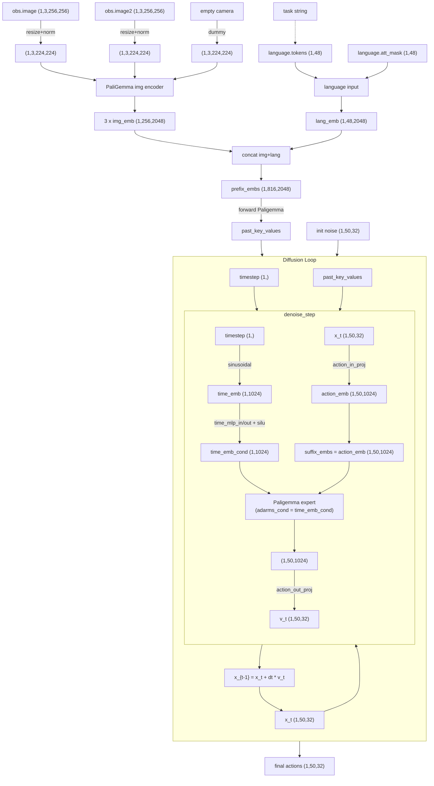

# 前言

> [!INFO]
> Pi-0.5目前官方开源的实现和原论文有所不同。
> 
> 在阅读本文之前，强烈建议先阅读[[Lerobot Pi-0 Hands-on]]。

参考 https://github.com/Physical-Intelligence/openpi/issues/647 。官方给的回应是：

> Jup that's correct -- we currently only support action decoding in openpi, but as [@Qu3tzal](https://github.com/Qu3tzal) mentioned this should already give you a capable policy!

![[file-20251016162633324.png]]

开源的 $\pi_{0.5}$ 代码没有加入论文中提到的low-level command机制。对比[[Pi-0|π0]]和 [[Pi-0.5|π0.5]]代码，改动很小。具体在以下几个方面：

1. 删掉了本体状态state和对应的MLP，直接没使用
    
2. action_time_emb变为直接使用action_emb作为suffix_emb，time_emb作为adarms_cond条件

其余代码和 $\pi_0$ 代码几乎一模一样。

概览图（可点击↔︎放大，往下拖）：

# 评测结果

| **任务**        | **LIBERO-10** | **LIBERO-goal** | **LIBERO-object** | **LIBERO-spatial** |
| ------------- | ------------- | --------------- | ----------------- | ------------------ |
| **Pi-0.5复现**  | 97.0%         | 97.6%           | 99.4%             | 97.6%              |
